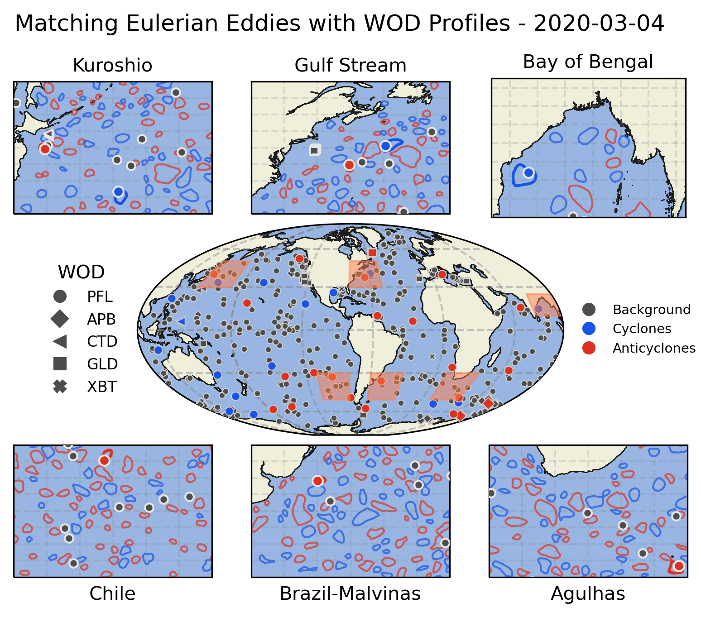

# Vortex-Profile Matching Dataset

## Data Access

The dataset is mirrored at the following servers:

| Mirror  | Link | Status |
|---------|------|--------|
| UMassD  | [Catalog](http://www.smast.umassd.edu:8081/thredds/catalog/Vortex_profiles/vortex_profiles/catalog.html) |  |
| WHOI    | [Catalog](http://bigcreek.whoi.edu:8080/thredds/catalog/VORTEX_PROFILE/catalog.html) |  |

## Overview
The **Vortex-Profile Matching Dataset** combines vertical profiles from the **World Ocean Database (WOD)** with mesoscale eddy data from the **META3.2 DT** altimetry-derived eddy atlas. This comprehensive dataset bridges the gap between oceanographic in situ measurements and satellite-based observations, enabling a better understanding of mesoscale eddies' vertical structure and their impact on heat, mass, and nutrient transport.

Key features:
- Over **4.2 million quality-controlled profiles** matched with more than **35 million vortex observations**.
- Inclusion of physical and biogeochemical parameters such as temperature, salinity, oxygen, chlorophyll, and nutrients.
- Accessibility through an **OPeNDAP server** for direct analysis and a downloadable Zenodo archive.

## Organization
The repository is organized as follows:
  - Scripts for dataset processing, analysis, and vortex-profile matching are available in the `/src` directory.
  - Includes tools for downloading, filtering, and matching profiles with eddies.
  - Examples of usage is provided in `/examples` directory.
 
## Contribution
We welcome contributions to improve the dataset, algorithms, and analysis. To contribute:
1. Fork the repository and create a new branch for your changes.
2. Submit a pull request with a detailed description of the modifications.

For bug reports or feature requests, please open an issue on the GitHub repository.
For questions regarding its usage, please open a discussion.

